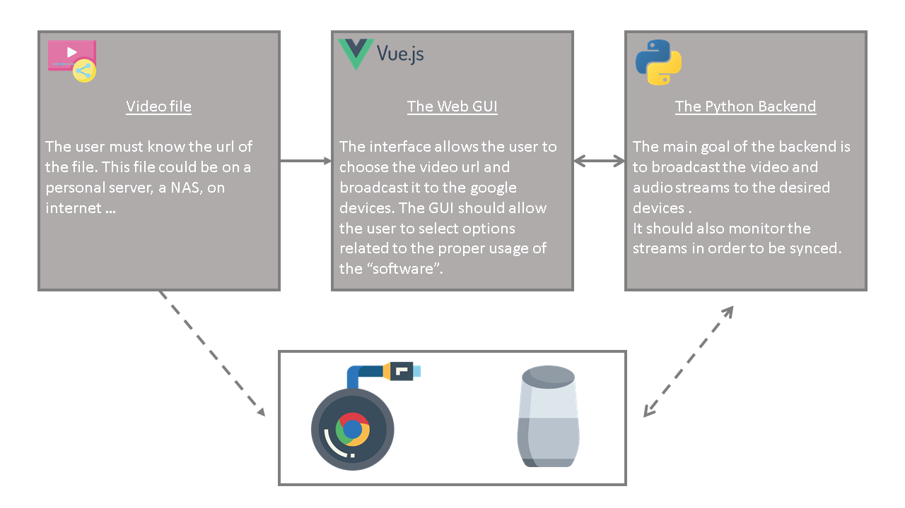
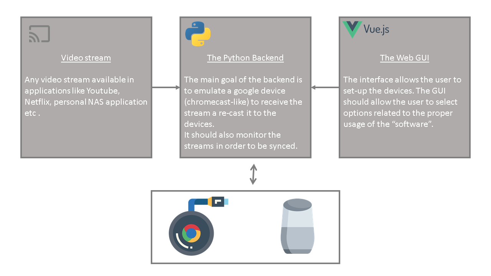

# Cinecast

The goal of this project is to provide a tool in order to use the Google speakers (google home, google nest audio etc.) as Home Cinema speakers for the chromecasts video devices.

For now, the main tool is under-construction. Please be indulgent for the code architecture and implementation.

All credits of the chromecast interaction should be attributed to the [pychromecast project](https://github.com/home-assistant-libs/pychromecast) since it is the main python library and the core of the project currently.

## Roadmap

### Features to be built for the v0

- [x] Play a video file from url on the Chromecast.
- [x] Play the audio of a video file on the Speakers.
- [x] Synch the audio and the video.
- [x] Use a web-app as a GUI for the.
- [ ] Raspberry-Pi compatibility.
- [ ] Production python API.

### Features wanted for the v1

- [ ] Be a chromecast-like receiver / emulator in order to use any video stream like an usual Chromecast (ie: from YT, Netflix etc.).

## Architecture

### Currently



### What I imagined



## Get started

### For the Python backend

For developpement server :  

```bash
python3 wsgi.py
```

For production server :

To be determined but I imagined using gunicorn like :

```bash
sh backend.sh
```

### For the webserver (GUI)

for dev purpose, the classic :

```bash
npm run serve
```

## Restrictions

For now, the .mp4 files seams to be displayed properly in the chromecast. I had some issues working with .avi files. 
